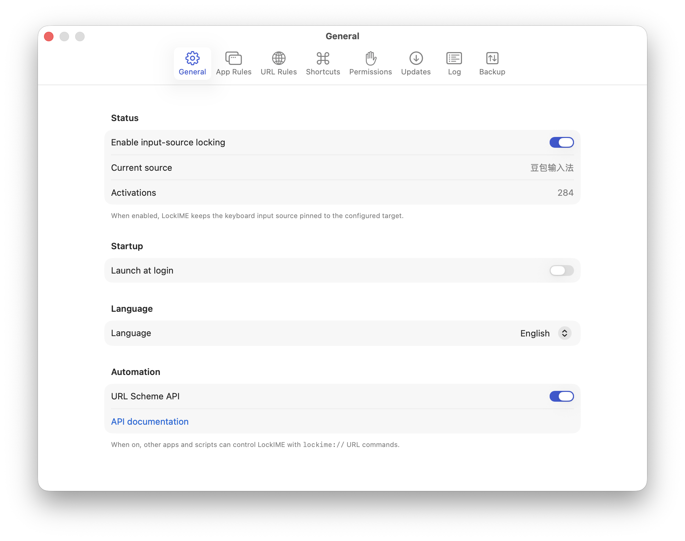
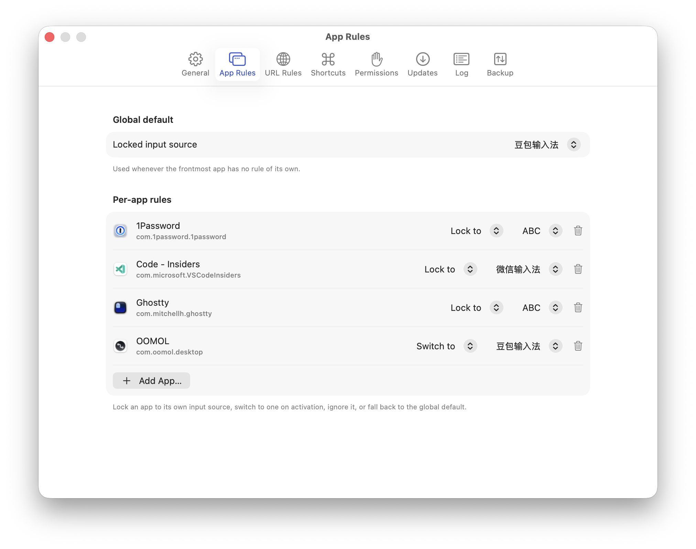
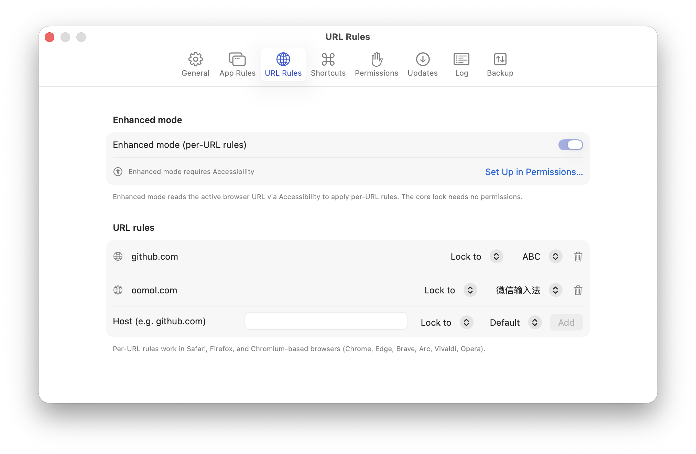

<div align="center">


# LockIME

[English](../../README.md) · [简体中文](README.zh-CN.md) · [繁體中文](README.zh-TW.md) · [日本語](README.ja.md) · **Français** · [Deutsch](README.de.md) · [Español](README.es.md) · [Português](README.pt.md) · [Русский](README.ru.md)

[](https://github.com/oomol-lab/LockIME/releases/latest)
[](https://github.com/oomol-lab/LockIME/actions/workflows/ci.yml)
[](../../LICENSE)
[](https://www.apple.com/macos/)
[](https://swift.org)

</div>

Une application de barre de menus macOS qui **verrouille votre source de saisie clavier**. Chaque fois que vous (ou une autre application) changez de méthode de saisie, LockIME rebascule immédiatement vers celle qui est verrouillée — globalement, par application au premier plan, ou (avec le mode renforcé optionnel) par URL de navigateur.

> macOS 14+ · Apple silicon et Intel — applications séparées, téléchargez le
> fichier `-arm64` ou `-x86_64` correspondant à votre Mac · construite avec
> SwiftUI, Liquid Glass sous macOS 26 (Tahoe).

## Screenshots

<p align="center">
  <picture>
    <source media="(prefers-color-scheme: dark)" srcset="../images/settings-general-en-dark.png">
    
  </picture>
  <picture>
    <source media="(prefers-color-scheme: dark)" srcset="../images/settings-app-rules-en-dark.png">
    
  </picture>
  <picture>
    <source media="(prefers-color-scheme: dark)" srcset="../images/settings-url-rules-en-dark.png">
    
  </picture>
</p>

## Install

Installez avec [Homebrew](https://brew.sh) (le cask choisit le build correspondant à l'architecture de votre Mac) :

```sh
brew install --cask oomol-lab/tap/lockime
```

Ou téléchargez le `.dmg` correspondant à votre Mac (`-arm64` pour Apple silicon, `-x86_64` pour Intel) depuis la [dernière version](https://github.com/oomol-lab/LockIME/releases/latest). Dans les deux cas, l'application se maintient automatiquement à jour via Sparkle.

## Features

- **Reverrouillage instantané** — rebascule la source de saisie active dès que vous (ou une autre application) la changez, globalement ou par application.
- **Verrouiller ou basculer** — les règles par application et par URL peuvent *verrouiller* une source de saisie (réappliquée dès qu'elle dévie) ou simplement y *basculer* une fois lorsque vous activez l'application ou la page, puis vous laisser libre de la changer.
- **Verrouiller globalement, ou simplement basculer** — un unique interrupteur **Activer LockIME** alimente tout ; une bascule subordonnée **Activer le verrouillage** ne contrôle que le verrouillage continu. Désactivez le verrouillage pour utiliser LockIME comme un simple commutateur par application/par site — il vous bascule en entrant, puis vous laisse libre, sans rien épingler.
- **Correspondance d'URL flexible** — les règles par URL (mode renforcé) correspondent par un domaine et ses sous-domaines, un domaine exact, un mot-clé de domaine, ou une expression régulière sur l'URL entière, et s'appliquent dans un ordre de priorité que vous organisez par glisser-déposer — la première correspondance l'emporte.
- **Contrôle depuis la barre de menus** — activer/désactiver, changer la source de saisie verrouillée, voir la source actuelle et suivre le nombre d'activations depuis la barre de menus.
- **Raccourcis clavier** — des raccourcis globaux configurables pour activer/désactiver LockIME et faire défiler la source de saisie verrouillée, ainsi que des raccourcis par application pour faire défiler ou supprimer la règle de l’application au premier plan.
- **Lancement à la connexion** — démarre automatiquement à l'ouverture de session (désactivé par défaut).
- **Mode clair et sombre** — un langage de design unifié et natif du système, qui s'adapte aux apparences claire et sombre, avec une icône d'application sur mesure. Voir [docs/DESIGN.md](../DESIGN.md).
- **Changement de langue à chaud** — basculez instantanément entre 9 langues, sans redémarrage : English, 简体中文, 繁體中文, 日本語, Français, Deutsch, Español, Português, Русский.
- **Journal d'activation sur 24 heures** — consultez ce qui a été rebasculé, pourquoi, et pendant combien de temps.
- **Sauvegarde de la configuration** — exportez vos règles par application et par URL dans un fichier `.lockime`, puis réimportez-les, avec une étape de prévisualisation qui liste les ajouts, les conflits et les suppressions avant toute application.
- **Mise à jour automatique** — canaux stable et beta via Sparkle, avec une fenêtre de mise à jour personnalisée.
- **Téléchargement minuscule** — toute l'application tient dans un `.dmg` de moins de 3 MB.
- **Aucune permission système pour le verrouillage de base** — un mode renforcé optionnel, soumis à l'autorisation Accessibility, débloque des règles plus fines par URL et par champ ayant le focus.
- **Automatisation** — un schéma d'URL `lockime://` permet à d'autres applications, scripts et Shortcuts de piloter LockIME (voir ci-dessous).

## Comparison

Le paysage des sources de saisie sous macOS compte deux alternatives largement
utilisées à LockIME —
**[Input Source Pro](https://github.com/runjuu/InputSourcePro)** (≈3.3k★, la
plus populaire) et **[KeyboardHolder](https://github.com/leaves615/KeyboardHolder)**
(≈1.6k★) — ainsi qu'une longue série d'outils open-source et CLI plus modestes.
Tous *basculent* la source de saisie à mesure que vous passez d'une application
ou d'un site à l'autre ; LockIME est celle qui est conçue autour d'un
**verrouillage** continu qui réapplique la source de saisie dès qu'elle dévie,
tout en laissant chaque règle individuelle se rabattre sur une *bascule* unique
lorsque c'est tout ce que vous voulez.

| | LockIME | Input Source Pro | KeyboardHolder |
|---|---|---|---|
| Prix | Gratuit | Gratuit | Gratuit (don) |
| Open source | GPL-3.0 | GPL-3.0 | ✗ (fermé) |
| macOS minimum | 14 | 11 | 10.15 |
| Taille de téléchargement | < 3 MB | ≈ 7.6 MB | ≈ 4.5 MB |
| Règles par application | ✓ | ✓ | ✓ |
| Règles par site / URL | ✓ | ✓ | ✓ |
| Types de correspondance d'URL | sous-domaine · exact · mot-clé · regex | sous-domaine · exact · regex | domaine (joker) |
| Règle de barre d'adresse (champ URL) | ✓ (verrouillage/bascule/priorité) | ✓ (source par défaut) | — |
| Reverrouillage continu | ✓ | ✗ | ✗ |
| Verrouiller *ou* basculer une fois, par règle | ✓ | ✗ | ✗ |
| Raccourcis clavier globaux | ✓ | ✓ | ✗ |
| Contrôle depuis la barre de menus | ✓ | ✓ | ✓ |
| Indications de saisie à l'écran | ✗ | ✓ | ✓ (optionnel) |
| Journal d'activation sur 24 heures | ✓ | ✗ | ✗ |
| Sauvegarde / import de la configuration | ✓ (`.lockime`, avec prévisualisation) | ✓ (export/import + CLI) | — |
| Automatisation par schéma d'URL | ✓ (`lockime://`, x-callback-url) | partiel (import `inputsourcepro://`) | ✗ |
| Langues de l'interface | 9 (changement à chaud) | 6 | zh · en · ja |
| Permissions système | aucune pour le cœur · Accessibility par URL | aucune pour le cœur · Accessibility par URL | Accessibility¹ |
| Mise à jour automatique | Sparkle (stable + beta) | ✓ | ✓ |
| Activement maintenu (2026) | ✓ | ✓ | ✓ |

¹ KeyboardHolder ne documente pas ses exigences en matière de permissions ; la
lecture de la barre d'adresse du navigateur pour ses règles par site nécessite
en pratique l'accès Accessibility.

**Autres outils à connaître :**
[SwitchKey](https://github.com/itsuhane/SwitchKey) (≈959★, GPL-3.0, uniquement
par application automatique, non maintenu depuis 2021),
[Kawa](https://github.com/hatashiro/kawa) (≈1.5k★, MIT, bascule *manuelle*
pilotée par raccourci, non maintenu depuis 2017), InputSwitcher (freemium,
uniquement par application), et
[macism](https://github.com/laishulu/macism) (une brique CLI pour l'intégration
aux éditeurs, pas un commutateur graphique).

**Où se situe LockIME :** choisissez **Input Source Pro** pour la plus grande
communauté et les indications de saisie à l'écran les plus riches — un
indicateur flottant qui suit votre curseur, avec des palettes de couleurs et des
réglages de position. Optez pour **KeyboardHolder** pour une mémoire par
application soignée et sans configuration, qui fonctionne tout simplement.
Tournez-vous vers **LockIME** lorsque vous voulez *épingler* une source de saisie
plutôt que simplement la basculer : un **verrouillage** strict par application,
par URL ou par barre d'adresse qui se réapplique dès que quoi que ce soit la
change — avec un mode *bascule* unique par règle, un type de correspondance d'URL
`keyword`, une riche automatisation `lockime://` (x-callback-url, contrôle
complet de l'état), un journal d'activation sur 24 heures, la localisation la
plus large du groupe (9 langues), et le plus petit téléchargement (moins de
3 MB).

> Les chiffres sont approximatifs et ont été recueillis à la mi-2026 (Input
> Source Pro 2.11.0, KeyboardHolder 1.14.10) ; un « — » signale une capacité non
> documentée, et non une absence confirmée. Les étoiles, les tailles et les
> capacités évoluent — les corrections sont les bienvenues.

## Automation

LockIME expose un schéma d'URL `lockime://` afin que d'autres applications, scripts, Shortcuts et lanceurs puissent le piloter — activer/désactiver le verrouillage, recibler la source de saisie, gérer les règles et relire l'état grâce aux rappels [x-callback-url](https://x-callback-url.com). Elle est désactivée par défaut — activez-la dans **Réglages ▸ Général ▸ Automatisation**.

```sh
open "lockime://lock"
open "lockime://lock-to-source?id=com.apple.keylayout.ABC"
open "lockime://set-app-rule?bundle=com.apple.Terminal&mode=lock&source=com.apple.keylayout.ABC"
```

Référence complète : **[URL Scheme API](../URL-Scheme-API/README.fr.md)**.

## Design

LockIME suit un système de design unique (`Sources/LockIME/UI/DesignSystem.swift`) : couleurs sémantiques, matériaux système et SF Symbols pilotent l'adaptation clair/sombre ; Liquid Glass est réservé à la couche flottante/de navigation. La couleur d'accent de la marque, « Lock Indigo », est fournie en tant qu'asset `AccentColor`. La spécification complète se trouve dans [docs/DESIGN.md](../DESIGN.md).

L'icône de l'application est générée par programme (sans outil de design) — régénérez-la avec :

```sh
./scripts/make-appicon.sh   # renders the master via SwiftUI and rebuilds the appiconset
```

## Development

Nécessite Xcode 26+ (l'application elle-même cible macOS 14+), ainsi que [XcodeGen](https://github.com/yonaskolb/XcodeGen) + [xcbeautify](https://github.com/cpisciotta/xcbeautify) (`brew install xcodegen xcbeautify`).

```sh
make gen     # generate LockIME.xcodeproj from project.yml
make build   # build (Debug)
make run     # build & launch
make test    # run unit tests
make archive # Release archive (Developer ID)
```

Le projet Xcode est généré à partir de `project.yml` et n'est pas versionné.

Les tests d'intégration touchant au matériel (bascule TIS réelle) sont exclus de `make test` ; lancez-les avec `make test-hw` (change brièvement la source de saisie).

## Releasing

Des versions Developer ID notariées, pilotées par dispatch, avec mise à jour automatique Sparkle sur les canaux **stable** et **beta** : lancez le workflow Release (Actions → Release) — il calcule la version à partir des tags git, construit, puis crée automatiquement le tag et la GitHub Release — ne poussez jamais un tag à la main. Le canal beta correspond au build nightly. Chaque version fournit des applications Apple silicon et Intel séparées, chacune sur son propre flux de mise à jour (pas de binaire universal, pas de mise à jour entre architectures). Voir [docs/RELEASING.md](../RELEASING.md).

## Architecture

- **LockIMEKit** (bibliothèque statique) — logique pure, entièrement couverte par des tests unitaires, n'utilisant que les frameworks système : moteur de verrouillage, moniteur d'applications, règles, observateur renforcé (Accessibility), modèle de journalisation, localisation.
- **LockIME** (application) — `@main`, l'interface SwiftUI, le système de design, et les fines couches d'intégration pour Sparkle, KeyboardShortcuts et PermissionFlow.

## License

Copyright © 2026 Hangzhou Wumou Software Co., Ltd.
